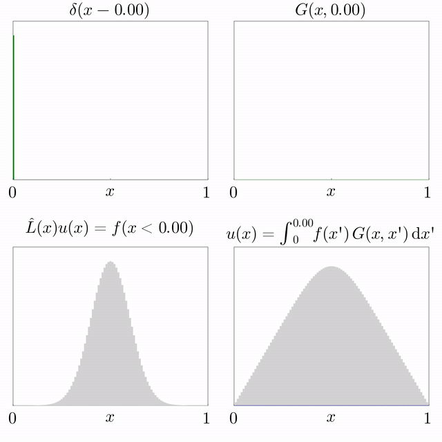

# [Green's function](https://en.wikipedia.org/wiki/Green%27s_function)
格林函数是一个解偏微分方程的重要工具, 除了格林函数还可以用傅里叶变换。  
格林函数定义 : ${\displaystyle L\,G(x,s)=\delta (s-x)\,}$ 其中 :
- $L$ 是任意线性微分算子, 线性的意思是微分算子的组合也可以，比如说 $\frac {\partial u}{\partial t} - \nabla^2u $
- $\delta (s-x)$  [Dirac delta function](https://en.wikipedia.org/wiki/Dirac_delta_function)
- 格林函数是 $L$ 的 [fundamental solution](https://en.wikipedia.org/wiki/Fundamental_solution)
## 格林函数作用
- 对给定偏微分方程 $Lu(x) = f(x)$ 求 $u(x)$
1. 可以借助格林函数构造方程
$$
\int LG(x, s)f(s)ds = \int \delta(s-x)f(s)ds = f(x) 
$$ 
2. 将线性微分算子从积分符号内提出来
$$
L\int G(x, s)f(s)ds = f(x)
$$ 
3. 得到 $u(x)$
$$
u(x) = \int G(x, s)f(s)ds
$$ 
4. 问题变成了寻找$G(x,s)$ 满足格林函数定义, 格林函数 $ G(x, \delta) $ 可以表示为：
$$
G(x, \delta) = \begin{cases} 
u(\delta) & \text{当 } L G(x, \delta) = \delta(x - \delta) \\
0 & \text{其他情况}
\end{cases}
$$
## 例子

#### 1. 对于一维空间中的扩散方程 $\frac{\partial u(x,t)}{\partial t} = \alpha (\nabla^2 u(x,t)) $  
存在 $G(x,t; x_0,t_0)$ 使得 
$$
    \frac{\partial G}{\partial t} = \alpha (\nabla^2 G) 
$$  
经过查表已知格林函数可以表示为：
$$
G(x,t:x_0, t_0) = \frac {1}{ \sqrt {4\pi \alpha (t - t_0)}}e^{(-\frac {(x -x_0)^2}{4\alpha (t - t_0)})}
$$
得到 
$$
    u(x, t) = \int G(x,t:x0,t0)f(x0)dx0
$$
在已知$G(x, t:x0, t0)$要求上述积分，还需要确定初始条件$f(x0)$
- 脉冲函数 : $\delta(x- x0)$
- 均匀分布 : f(x0) = 1 表示系统在所有位置上均匀分布。
- 其他分布 : 如高斯分布或其他物理上合理的初始条件。  

```完整过程参考:```  [用格林函数求扩散方程](#用格林函数求扩散方程)


<!-- 
- 对于三维空间中的拉普拉斯算子 $ \nabla^2 $，格林函数可以表示为：
$$
LG(x, \delta) = -\frac{1}{4\pi \|x - \delta\|}
$$
$\nabla^2G(x, x_0) = u$
$$
F(u(x:x0, k)) = \int_{-inf}^{inf} ue^{-\frac {ik\pi}{x_0}} dx_0
$$ -->


<!-- ## 在散度定理中应用格林函数
散度定理公式， 高维的散度积分等于低维的整体积分:
$$
\int_V \nabla \cdot u(x) dV = \int_S u(x) d\hat{\sigma}
$$
1. 令 $LG(x, x0) = \nabla \$ -->

## 用格林函数求扩散方程
### 1. **确定初始条件 $ f(x_0) $**
首先，需要知道问题的初始条件 $ f(x_0) $，即在 $ t = t_0 $ 时的 $ u(x,t_0) $ 的值。这代表系统在初始时刻 $ t_0 $ 的状态。常见的初始条件有：
- **脉冲函数**（如 $ \delta(x - x_0) $）：这表示一个位置上的单位脉冲。
- **均匀分布**：如 $ f(x_0) = 1 $ 表示系统在所有位置上均匀分布。
- **其他分布**：如高斯分布或其他物理上合理的初始条件。

### 2. **使用格林函数 $ G(x,t;x_0,t_0) $**
格林函数在扩散方程中提供了从某个初始位置和时间传播到当前时刻的影响，它的形式通常为：
$$
G(x,t;x_0,t_0) = \frac{1}{\sqrt{4\pi D (t - t_0)}} \exp\left(-\frac{(x - x_0)^2}{4D(t - t_0)}\right)
$$
这个公式描述了从位置 $ x_0 $ 在时间 $ t_0 $ 开始扩散的影响在时间 $ t $ 和位置 $ x $ 的值。

### 3. **卷积公式求解**
将初始条件 $ f(x_0) $ 和格林函数 $ G(x,t;x_0,t_0) $ 带入卷积公式中：
$$
u(x,t) = \int_{-\infty}^{\infty} G(x,t;x_0,t_0) f(x_0) \, dx_0 \tag 1
$$
这个公式表示将初始条件 $ f(x_0) $ 与格林函数做卷积，得到系统在时间 $ t $ 和位置 $ x $ 的解。

### 4. **实际解的步骤**
#### (1) **脉冲初始条件：**
如果初始条件是 $ f(x_0) = \delta(x_0 - x_1) $，即在 $ x_1 $ 处的单位脉冲带入 (1)可以得到：
$$
u(x,t) = G(x,t;x_1,0) = \frac{1}{\sqrt{4\pi D t}} \exp\left(-\frac{(x - x_1)^2}{4Dt}\right)
$$
这个解描述的是脉冲在扩散过程中的传播，呈现为一个随着时间扩展的高斯分布。

#### (2) **均匀初始条件：**
如果初始条件是均匀分布 $ f(x_0) = 1 $，则：
$$
u(x,t) = \int_{-\infty}^{\infty} \frac{1}{\sqrt{4\pi D t}} \exp\left(-\frac{(x - x_0)^2}{4Dt}\right) dx_0
$$
这个积分的结果是常数 $ u(x,t) = 1 $，表示扩散的均匀初始条件不会随时间改变。

#### (3) **高斯初始条件：**
如果初始条件是高斯分布 $ f(x_0) = \exp\left(-\frac{(x_0 - x_1)^2}{2\sigma^2}\right) $，则代入后通过卷积可以得到一个随着时间演化的高斯分布。

### 5. **总结**
用 $ u(x,t) $ 求解扩散方程的步骤包括：
- 选择并确定初始条件 $ f(x_0) $；
- 使用格林函数 $ G(x,t;x_0,t_0) $；
- 利用卷积公式 $ u(x,t) = \int G(x,t;x_0,t_0) f(x_0) \, dx_0 $ 求解具体的 $ u(x,t) $。

这些步骤可以应用到不同的初始条件，从而求出扩散方程的具体解。